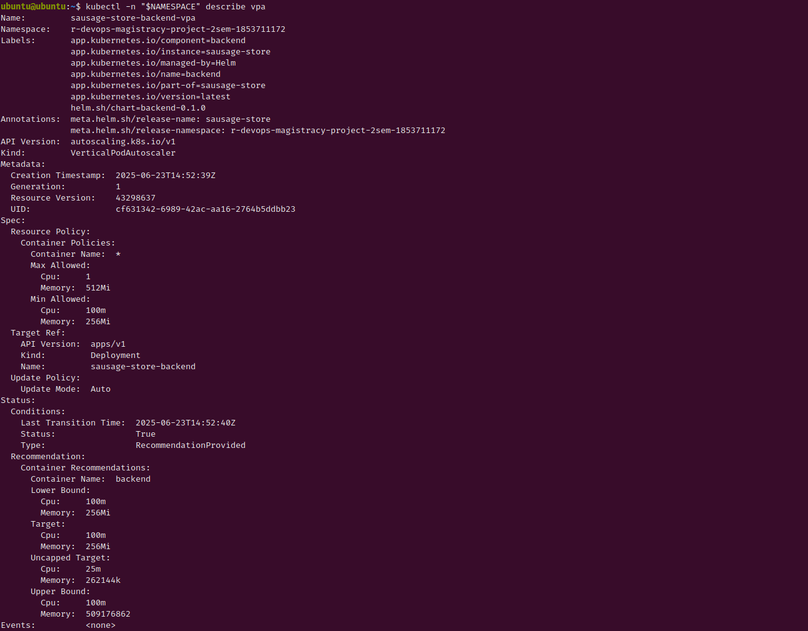

# Sausage Store


## Technologies used

* Frontend – TypeScript, Angular.
* Backend  – Java 16, Spring Boot, Spring Data.
* Database – H2.

## Installation guide
### Backend

Install Java 16 and maven and run:

```bash
cd backend
mvn package
cd target
java -jar sausage-store-0.0.1-SNAPSHOT.jar
```

### Frontend

Install NodeJS and npm on your computer and run:

```bash
cd frontend
npm install
npm run build
npm install -g http-server
sudo http-server ./dist/frontend/ -p 80 --proxy http://localhost:8080
```

Then open your browser and go to [http://localhost](http://localhost)

## Итоги

### Пайплайн CI/CD

Автоматизированный процесс включает три основных этапа:
- **Build & Push Docker Images** (1 мин. 59 сек.) - сборка и публикация Docker-образов всех микросервисов в Docker Hub
- **Package & Push Helm Chart** (11 сек.) - упаковка Helm-чарта и загрузка в Nexus Repository
- **Deploy to Kubernetes** (20 сек.) - автоматическое развертывание приложения в целевой Kubernetes-кластер

<details>
<summary><b>Скриншот - Полный цикл CI/CD</b></summary>


</details>

### Состояние компонентов в Kubernetes

Все компоненты приложения успешно развернуты и функционируют в namespace `r-devops-magistracy-project-2sem-1853711172`:
- **mongodb-0** - база данных MongoDB (StatefulSet)
- **postgres-0** - база данных PostgreSQL (StatefulSet)
- **sausage-store-backend** - основной API-сервис
- **sausage-store-backend-report** - сервис генерации отчетов
- **sausage-store-frontend** - веб-интерфейс приложения

Статус всех pod'ов: `Running` без единого рестарта, что подтверждает стабильность работы.

<details>
<summary><b>Скриншот - Работоспособность всех микросервисов</b></summary>


</details>

### Сетевая конфигурация

Ingress-ресурс `sausage-store-frontend-ingress` настроен для обработки внешнего трафика:
- **Домен**: `dmitryfedoroff.2sem.students-projects.ru`
- **Внешний IP**: `158.160.176.69`
- **Порты**: 80 (HTTP), 443 (HTTPS с автоматическим TLS)
- **Класс**: nginx

Конфигурация обеспечивает безопасный доступ к приложению через HTTPS с автоматическим перенаправлением с HTTP.

<details>
<summary><b>Скриншот - Ingress-контроллер и маршрутизация трафика</b></summary>


</details>

### Автомасштабирование

VPA для backend-сервиса активен и предоставляет рекомендации по оптимизации ресурсов:
- **Режим обновления**: Auto
- **Статус**: RecommendationProvided
- **Рекомендации для контейнера backend**:
  - Target CPU: 100m, Memory: 256Mi
  - Uncapped Target CPU: 25m, Memory: 262144k
  - Upper Bound CPU: 100m, Memory: 589176862

VPA анализирует фактическое потребление ресурсов и предлагает оптимальные значения для повышения эффективности использования кластера.

<details>
<summary><b>Скриншот - Vertical Pod Autoscaler (VPA)</b></summary>


</details>

HPA для backend-report сервиса обеспечивает горизонтальное масштабирование:
- **Метрика**: CPU utilization (целевое значение 75%)
- **Диапазон реплик**: от 1 до 5
- **Текущее состояние**: 1 реплика при загрузке CPU 1%
- **Статус масштабирования**: DesiredWithinRange

HPA успешно рассчитывает количество реплик на основе загрузки CPU и поддерживает оптимальное количество экземпляров сервиса.

<details>
<summary><b>Скриншот - Horizontal Pod Autoscaler (HPA)</b></summary>


</details>

## Контакты

- **Автор**: Дмитрий Федоров
- **Эл. почта**: [fedoroffx@gmail.com](mailto:fedoroffx@gmail.com)
- **Telegram**: [https://t.me/dmitryfedoroff](https://t.me/dmitryfedoroff)